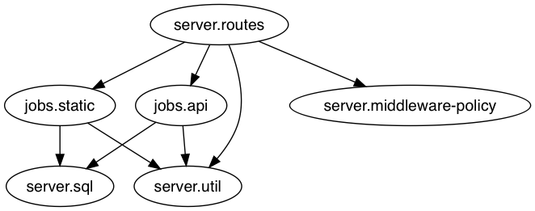

# compojure

[CircleCI Builds](https://circleci.com/gh/skilbjo/compojure)

[](https://circleci.com/gh/skilbjo/compojure/tree/master)
[](https://quay.io/repository/skilbjo/compojure)
[](https://codecov.io/gh/skilbjo/compojure)

[](https://healthchecks.io/badge/80da65e9-ff8f-45f1-b75e-109790/dLkCKQze/compojure_sfo.svg)
[](https://healthchecks.io/badge/80da65e9-ff8f-45f1-b75e-109790/bKryWOrC/compojure_aws.svg)

## What

A webserver in LISP FTW.



## TODOs

- [X] Escape SQL injection (note: no decent sql injection escaping libaries out there); used `clojure.string/escape`
- [ ] Check if datasets conform to allowed map of datasets. Else, give a 404 instead of throwing an exception
- [ ] Seeing this error: `java.lang.OutOfMemoryError: Java heap space`

Note: formerly valid sql injection: `http://localhost:8080/api/equities'select%201'--/latest`

## API

```bash
$ curl [host].duckdns.org/api/equities/latest

{"body":[{"open":148.45,"date":"2017-05-18T07:00:00Z","adj_volume":16101229.00,"adj_close":148.06, \
  "ticker":"FB","adj_low":147.96,"ex_dividend":0.00,"close":148.06,"volume":16101229.00,"high":149.39, \
  "adj_high":149.39,"split_ratio":1.00,"low":147.96,"adj_open":148.45,"dataset":"WIKI"}]}
```

## Deploy

Make sure the jks is in the prod servers:
    scp -P [port] java_key_store [user]@[bastion].:~

ssh to the prod servers, start tmux, and fire:
```bash
ssh [alias].
tm
deploy/bin/run-docker
```

### environment variables

```bash
export ro_jdbc_db_uri='jdbc:postgresql://[host]:[port]/[db_name]?sslmode=require&user=[user]&password=[pass]'
export quandl_api_key=''
# to run athena queries
export jdbc_athena_uri='jdbc:awsathena://athena.[region].amazonaws.com:[port]'
export s3_staging_dir='s3://aws-athena-query-results-[id]-[region]'
export aws_access_key_id=''
export aws_secret_access_key=''
```

## Debugging

- Did the jks made it onto the host ok? (`cat ~/[jks]; ls -la ~/[jks]`)
- Did the jks made it into the container ok? (`cat /[jks]; ls -la /[jks]`)
- Web server Listening on the port? (via another shell in the container)?
- If in a VM, port forwarding in the VM? (`netstat -tulpen` or `sockstat -l 4`)
- Port forwarding on the host? (`VBoxManage controlvm "default" natpf1 "tcp-port8443,tcp,,8443,,8443";`
- Latest docker image! (key!)

Did it work? (locally)
```bash
curl localhost:8080
curl --insecure localhost:8443
```

Did it work? (externally)
```bash
curl $(curl v4.ifconfig.co 2>/dev/null)
curl --insecure "https://$(curl v4.ifconfig.co 2>/dev/null)"
curl --insecure https://$(nslookup [host]-aws.duckdns.org | grep Address | tail -n1 | awk '{print $2}')
curl https://[host].duckdns.org
```

## Networking set up on AWS

### VPC

#### Network ACL
```
Protocol Scheme Port    Source    Allow/Deny
TCP      HTTP   (80)    0.0.0.0/0 ALLOW
TCP      HTTPS  (443)   0.0.0.0/0 ALLOW
```

#### Security Group
```
Protocol Scheme Port    Source    Allow/Deny
TCP      HTTP   (80)    0.0.0.0/0 ALLOW
TCP      HTTPS  (443)   0.0.0.0/0 ALLOW
```

### On the server
```bash
sudo iptables -t nat -A PREROUTING -p tcp --dport 80 -j REDIRECT --to-ports 8080
sudo iptables -t nat -A PREROUTING -p tcp --dport 443 -j REDIRECT --to-ports 8443
```

Revert

```bash
sudo iptables -t nat -D PREROUTING 1
```

## Networking set up on FreeBSD (docker-machine / VirtualBox)

Need to portforward host to guest ports.

```bash
VBoxManage controlvm "default" natpf1 "tcp-port8080,tcp,,8080,,8080";
VBoxManage controlvm "default" natpf1 "tcp-port8443,tcp,,8443,,8443";
```
## Security

### Port scanning

```bash
sudo nmap -v -sS -A -T4 $(nslookup [host]-aws.duckdns.org | grep Address | tail -n1 | awk '{print $2}')
sudo nmap -sS -O $(nslookup [host]-aws.duckdns.org | grep Address | tail -n1 | awk '{print $2}')
```

### Third party observations
- [https://observatory.mozilla.org/analyze.html?host=host.duckdns.org](https://observatory.mozilla.org/analyze.html?host=host.duckdns.org)

## Git

### Git remotes
```bash
git remote add pi-vpn ssh://[user]@[bastion].:43/~/deploy/git/compojure.git
git remote add pi-home ssh://[user]@[host]/~/deploy/git/compojure.git
```

### Pre-commit hook to update pom.xml
```bash
vim .git/hooks/pre-commit

#!/usr/bin/env bash

lein pom 2>&1 dev-resources/pom.xml
```

## lein

### Dependencies
```bash
lein deps :tree 2>deps 1>/dev/null && vim deps
```

### cljfmt
```bash
lein cljfmt check ; lein cljfmt fix
```

### kibits
```bash
lein kibit >tmp ; vim tmp && rm tmp
```

## Custom jdbc/query

```clojure
(defn- prepare-statement
  [sql params]
  (loop [sql sql
         kvs (map identity params)]
    (if (empty? kvs)
      sql
      (let [[[k v] & others] kvs]
        (recur (string/replace sql (str k) (str (jdbc/sql-value v)))
               others)))))

(defn query
  ([sql]
   (query sql {}))
  ([sql params]
   (with-open [conn (-> :ro-db-jdbc-uri env java.sql.DriverManager/getConnection)]
     (let [sql     (-> sql
                       (string/replace #";" "")
                       (string/replace #"--" "")
                       (string/replace #"\/" "")
                       (string/replace #"\/\*" "")
                       (string/replace #"\*\\" "")
                       (prepare-statement params))
           results (-> conn
                       (.createStatement)
                       (.executeQuery sql))]
       (jdbc/metadata-result results)))))
```

## Resources
- [ ] [http://markgandolfo.com/blog/2014/01/10/a-simple-blog-in-clojure/](http://markgandolfo.com/blog/2014/01/10/a-simple-blog-in-clojure/)
